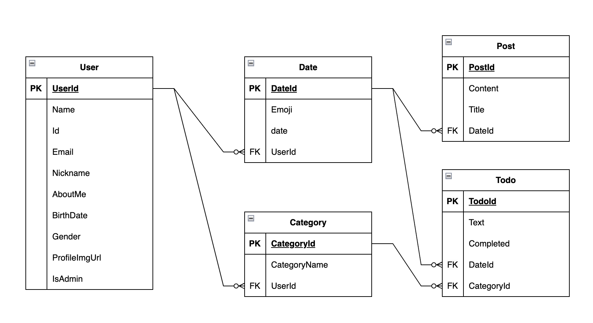

# 오늘도 코딩

## 🤗 팀원 소개

| 팀원명 | 역할     | 담당부분                                                                                                                                                                                         |
| ------ | -------- | ------------------------------------------------------------------------------------------------------------------------------------------------------------------------------------------------ |
| 위민영 | 팀장, FE | 캘린더 기능 및 홈 화면 전체 담당                                            |
| 유이든 | FE       | 로그인, 회원가입 등의 user 정보 관련 기능 구현                                                  |
| 김래희 | FE       | 게시글 관련 기능 구현                                                                                             |
| 정다희 | FE       | 전체 와이어 프레임제작 및 전제척인 디자인 수정                                                                                               |
| 곽수경 | FE, BE       | 백엔드 - ERD 설계   - 로그인(JWT) 기능 구현 - Todo(할일) CRUD, Post(게시글) CRUD 구현  - 어제 하지 못한(체크하지 않은) Todo 목록을 오늘로 옮기는 하는 기능 구현 프론트엔드  - Todo 목록 관련 기능 구현  |

 

## 📁 ERD 

 

##  🔎 프로젝트 서비스 소개

TODO & 일지 작성 사이트

추천 대상!

1. 학습일지를 마크다운 문서로 기록하고 싶으신 분들 
2. 일 단위로 학습 일정을 관리하고 싶은 분들 
3. 개인 블로그 및 일정 관리를 동시에 하고 싶은 개발자

#### 🛠 기술 스택
 
             

##  
 

### 👀 실제 동작 시연 (직접 시연)

